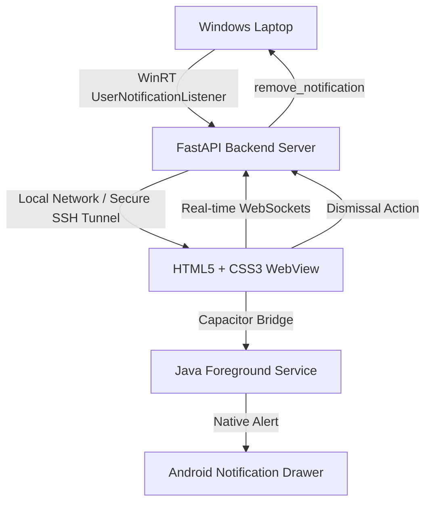

# NotiSync - Windows Notification Sync (PWA & Android Native)

NotiSync is a lightweight, premium background utility that captures notification toasts from your Windows laptop (e.g. Teams, WhatsApp, Chrome, Discord) and forwards them in real-time to any connected mobile device or tablet.

It offers two frontend integration models:
1. An installable **Progressive Web App (PWA)** accessible via your local network or a public secure SSH tunnel.
2. A wrapped **Native Android App (via Capacitor)** featuring a persistent Java background service that wakes up the device to sync notifications natively in real-time.

Overhauled with a premium, high-vibrancy **Electric Cyber-Cyan and Emerald Green** visual aesthetic.

---

## 📐 Project Architecture



---

## 🗺️ Project Map (Workspace Structure)

Here is a map of the project files and what they do:

```text
noti/
├── .venv/                  # Python Virtual Environment
├── static/                 # Static Assets for Frontend
├── static/app.js           # Client logic (WS, DOM diffing, setup panel, Capacitor plugin hooks)
├── static/style.css        # Glassmorphic cyber design (electric cyan, emerald glows, dark slates)
├── static/sw.js            # Service Worker for PWA cache & offline loading
├── static/manifest.json    # PWA configuration
├── templates/index.html    # Mobile pairs dashboard with html5-qrcode scanner integration
├── main.py                 # FastAPI backend running WinRT notification polling loop
├── run.py                  # CLI startup assistant (IP detection, console QR, tunnel management)
├── start_notisync.bat      # One-click startup launcher
├── build_capacitor.py      # Script to build and copy web assets to the android public directories
├── android/                # Capacitor Android Project root
│   ├── app/build.gradle    # Custom app configurations and OkHttp dependencies
│   ├── gradle.properties   # Permanently locks Java home compiler path to JDK 17
│   └── app/src/main/       # Native manifest & Java service source codes
└── [diagnostic-tests]/     # Diagnostic test suites (test notifications, polling, and WebSockets)
```

---

## 🚀 How to Run NotiSync

### 1. Run the Laptop Server
1. Double-click the [`start_notisync.bat`](file:///c:/Users/aakas/OneDrive/Desktop/noti/start_notisync.bat) script in the root directory.
2. Choose your network route:
   - **`1` (Local Wi-Fi Mode):** Direct local IP routing (e.g. `http://192.168.1.100:8000`).
   - **`2` (Internet Remote Mode):** Automatically configures a `localhost.run` SSH tunnel to map a public secure URL (e.g. `https://xxxx.lhr.life`).

### 2. Run the PWA (Web Client)
- Open the printed URL in your phone browser.
- Tap **"Install App"** (Chrome on Android) or **"Add to Home Screen"** (Safari on iOS) to place NotiSync on your home screen.

### 3. Compile and Run the Native Android App
To compile the APK with the persistent background sync plugin:
1. Open a terminal in the `android` folder:
   ```powershell
   cd android
   ```
2. Stop active daemons and compile the debug APK (configured to compile under Java 17):
   ```powershell
   .\gradlew --stop
   .\gradlew assembleDebug
   ```
3. Transfer and install the generated APK located at:
   `android/app/build/outputs/apk/debug/app-debug.apk`

---

## 📊 Feature & Progress Roadmap

### 🟢 Completed Features (Ready)
- [x] **Real-time Capture:** Intercepts Windows notification additions and dismissals via `UserNotificationListener` polling.
- [x] **Bidirectional Dismissal:** Dismissing a notification card on the phone clears it from the laptop Action Center in real-time.
- [x] **Smooth UI (DOM Diffing):** Custom rendering engine that updates elements in-place to prevent layout flashing.
- [x] **Vibrant Cyber Redesign:** Transitioned to high-vibrancy Electric Cyber-Cyan & Emerald Green glowing aesthetic.
- [x] **Details Modal:** Click notifications to inspect full titles and multi-line body texts with a "Copy to Clipboard" shortcut.
- [x] **In-App Camera QR Scanner:** Tap the floating camera button to scan laptop screen QR codes and switch sessions instantly.
- [x] **Audio Chimes:** Toggleable synth audio chime alert generated natively using the Web Audio API on new arrivals.
- [x] **Capacitor Android Scaffold:** Native packaging and plugin bindings to launch the background sync client.

### 🟡 In Progress / Polish
- [ ] **Android Drawer Posting:** Linking the Java background websocket channel to generate native drawer-notification items on Android.
- [ ] **Notification History Database:** Persistent local storage (e.g. SQLite) on the laptop to view history/logs of past notifications even after they are dismissed.
- [ ] **App Filters:** Create custom categories (e.g., "Personal", "Work", "System") based on the sending application.

---

## 🔒 Technical Constraints & Security Notes

- **Read-Only App Data:** Due to Windows operating system sandboxing, one desktop application cannot programmatically click or inject text replies into notifications owned by other third-party applications (like Teams or WhatsApp). As a result, NotiSync is limited to displaying full notification payloads and syncing lifecycle removals (dismissals).
- **Gradle & JDK Version:** Modern Android Studio versions bundle Java 25. Because the project Gradle wrapper (8.2.1) is only compatible with Java 17, compiling must target a Java 17 runtime. This is configured permanently inside `android/gradle.properties`.
- **Windows Access Permissions:** Ensure notification access is allowed in Windows Settings under **Settings > Privacy & Security > Notifications > Allow apps to access notifications**.
